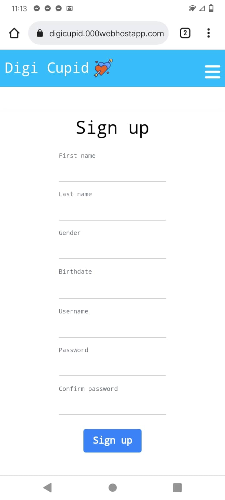

<kbd> </kbd>
# Digi Cupid
- A fully responsive mini social networking sites build on top of HMG-MINI-MVC framework

## Key features
- User Authentication
- Routing/url system privacy
- Adding posts
- Deleting posts
- Editing posts
- Comments
- profile
- file upload

## Desktop images

## Mobile images
| | | |
|:-------------------------:|:-------------------------:|:-------------------------:|
| |   | |  | 

## LICENSE
[MIT License](LICENSE)
